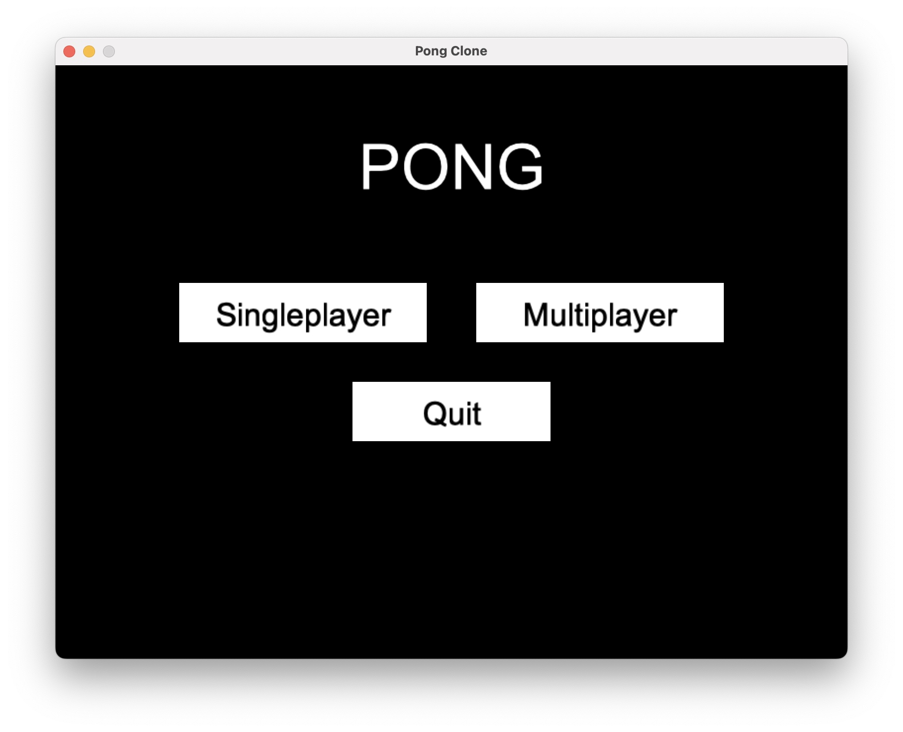
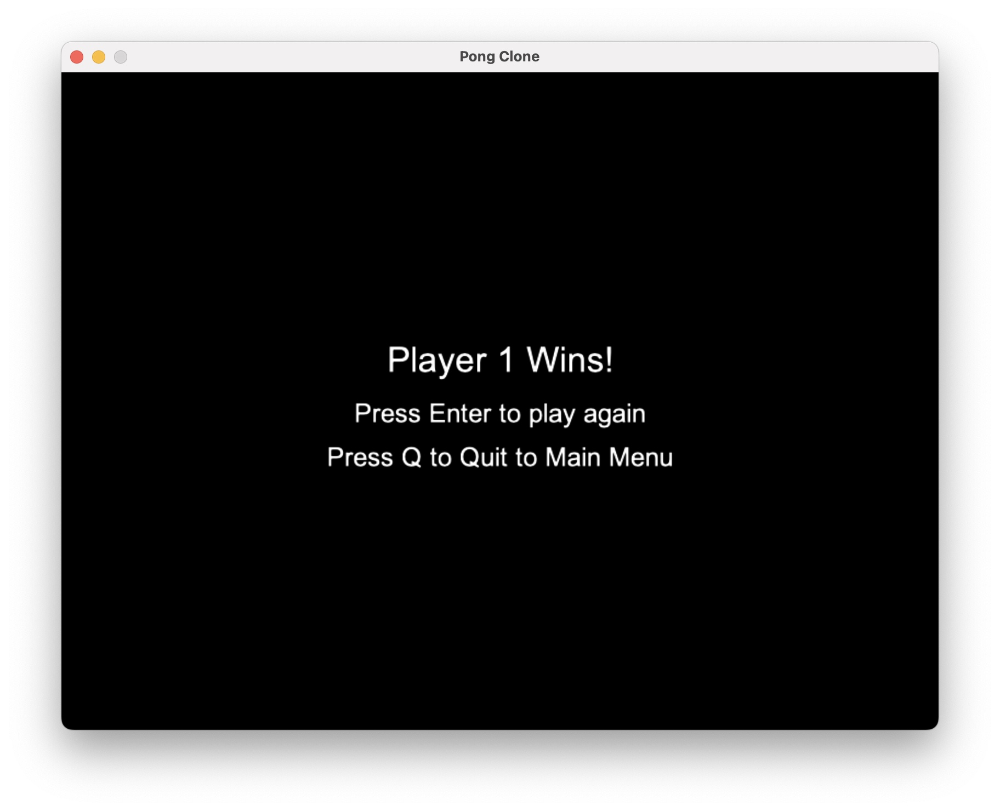

# Pong Clone
A simple Pong clone built with the Python Arcade library.
Includes single-player (AI) and local multiplayer modes, adjustable difficulty, and basic menus.

## Demo
### Video
[Click here](https://github.com/CadenLau/Pong-Clone/assets/gameplay/Pong_clone.mov)
### Screenshots
#### Main Menu

#### Gameplay

#### Game End

## Installation
    git clone https://github.com/CadenLau/Pong-Clone.git
    cd Pong-Clone
    pip install -r requirements.txt

## How to Run
    pip install arcade
    python main.py

## Controls
**Start Menus:** Use your mouse to select options. 
**Pause Menu:** Esc = unpause, Q = quit to Start 
**Game End Menu:** Enter = play again, Q = quit to Start
    
**Player 1:** W = up, S = down
**Player 2:** Up arrow = up, Down arrow = down   
**Other:** Esc = pause

## Features
- 60 FPS gameplay
- Adjustable AI difficulty
- Start, pause, and end menus
- Object-oriented structure using Arcade Views

## Project Structure
    pong/
    ├── main.py
    ├── font/
    ├── requirements.txt
    ├── .gitignore
    └── README.md

## Built With
- [Python Arcade](https://api.arcade.academy/en/latest/)
- [Pyglet](https://pyglet.readthedocs.io/en/latest/)
